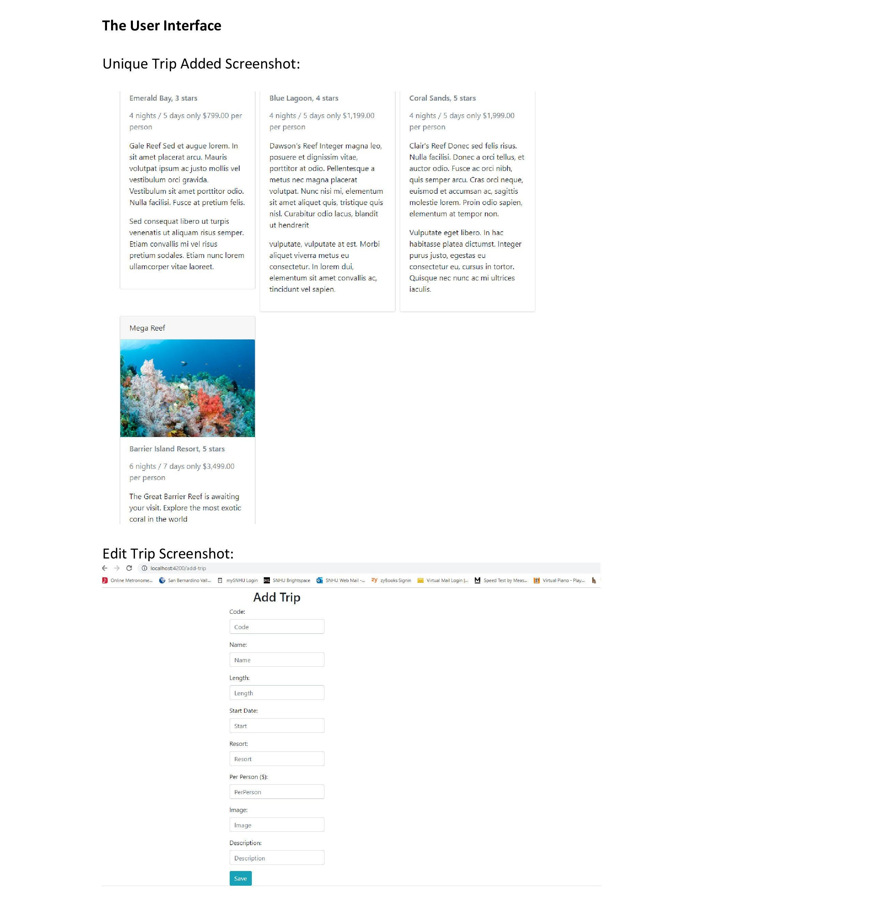
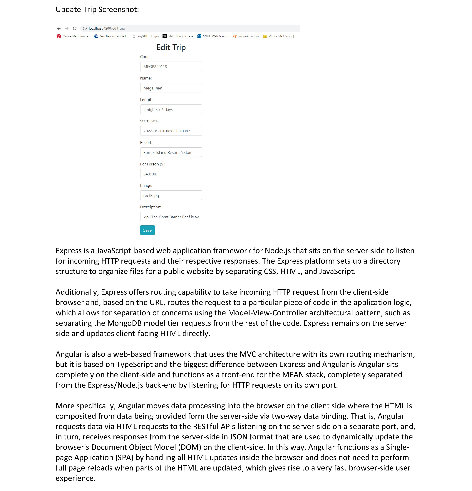
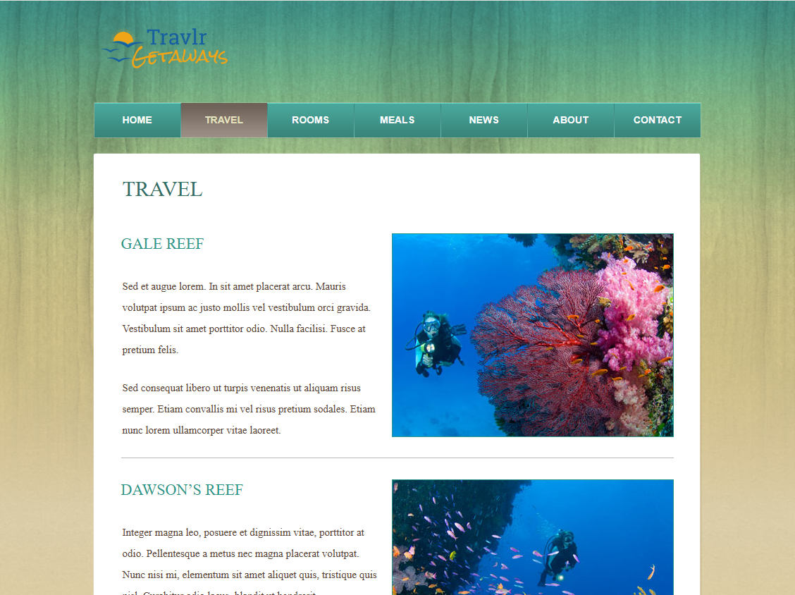

# Travlr Getaways – MEAN Stack Travel Booking Application

## Overview
Travlr Getaways is a full-stack web application designed for managing travel bookings. The system supports user registration, itinerary management, and administrative maintenance through a responsive, single-page application (SPA) interface.

This project demonstrates the implementation of the **Model–View–Controller (MVC) architectural pattern** using the MEAN stack:  
- **MongoDB** v4.0 for data storage  
- **Express.js** v4.16.1 for server-side logic  
- **Angular** v6.2.9 for the front-end SPA  
- **Node.js** v16.15.0 as the runtime environment  

---

## Key Features
- **User Registration and Authentication**
  - Secure account creation and login
- **Travel Package Management**
  - Search, create, update, and delete trip data
  - Admin-only access for editing content
- **RESTful API**
  - CRUD endpoints to manage trip records
- **Single Page Application**
  - Dynamic updates without full-page reloads
- **MVC Separation**
  - Clear division between data, logic, and presentation

---

## System Architecture
The application is structured into **three tiers**:

### 1. Presentation Tier (Angular)
- Responsible for all client-side rendering.
- Implements routing and view templates.
- Communicates with the server over RESTful APIs via `HttpClient`.
- Utilizes two-way data binding to update the DOM dynamically.

### 2. Business Logic Tier (Express.js + Node.js)
- Handles routing, authentication, and session management.
- Acts as middleware between the front end and database.
- Provides controller logic to process API requests.

### 3. Data Access Tier (MongoDB + Mongoose)
- Stores user accounts, travel packages, and booking data.
- Provides schema definitions and CRUD operations via Mongoose ODM.


### 4. Implementation details of Single-Page Application (SPA)

The first phase was building a static version of the application on top of an Express/Node.js framework on the server side. The static site essentially consisted of a collection of mockup hardcoded HTML pages, images, and CSS. No Express routes or separation of concerns were used in this phase of development.

For the second phase of frontend development, I migrated the static HTML to Handlebars template views, refactored repeated code like headers and footers into Handlebar "partials," and separated the concerns in Express into a Model-View-Controller (MVC) software architectural pattern. To implement the MVC pattern, I created a directory called "app_server" and a subdirectory in it called "controller" and various other directories to organize the code into the MVC pattern. I then established Express routes to direct client-side browser URL requests to the controller code, which was now used to render the Handlebars view templates and all other HTML to the frontend browser.

For the third phase, I further removed static hardcoded HTML from the Travlr site, such as the various Trips data, and refactored it into a static JSON file. Next, I updated the controllers to pass the JSON data to the respective Trips Handlebars view templates, where I included Handlebars directives to receive and parse the JSON into HTML dynamically to display in the browser.

For the fourth phase, I further separated concerns into a model structure with updates to the routes and controllers and implementation of Mongoose models to now retrieve the Trips JSON information from the MongoDB database via Mongoose models (schemas). The JSON returned from MongoDB was now sent to the Handlebars view templates instead of sourcing the static JSON data file for the Trips info.

During the final phase of the frontend development, the entire frontend was migrated from the server-side Express/Node.js over to a client-side Angular SPA site. For example, now the client will point their browser to a different HTTP port than the backend Express/Node HTTP port, which completely separates the frontend from the backend. To implement the SPA, I created various Angular components to create the TypeScript, HTML, and CSS files that would now dynamically render the HTML by making HTTP requests for JSON data to the Express/Node backend. The MVC design pattern was used to separate concerns by using Angular routes to various controllers, models, and views. For instance, the HTML in Angular is essentially a template that uses angle-bracketed selector tags as placeholders to receive HTML from Angular components. All HTML updates are now made in the browser itself on the client-side with Angular updating the Document Object Model directly. This gives rise to fast performance for the end-user.

---

## MVC Workflow
The application follows a clear MVC logic loop:

1. **View:** Angular renders the UI and captures user interactions.
2. **Controller:** Angular components make HTTP requests to the Express server.
3. **Model:** Express routes call Mongoose models to query MongoDB.
4. **Response:** Data is returned as JSON and used by Angular to update the view in real time.

---

## API Endpoints
A sample of the RESTful API routes:

| Method | Endpoint                  | Purpose                                  |
|--------|---------------------------|------------------------------------------|
| GET    | `/api/trips`              | Retrieve all trips                       |
| GET    | `/api/trips/:tripCode`    | Retrieve a single trip by code           |
| POST   | `/api/trips`              | Create a new trip                        |
| PUT    | `/api/trips/:tripCode`    | Update an existing trip                  |
| DELETE | `/api/trips/:tripCode`    | Delete a trip by code                    |

All endpoints accept and return JSON.

---

## Screenshots

### Sequence Diagram


---

### Class Diagram


---

### MEAN Stack Architecture Diagram


---

## User Interface – Example Screens





### Travel Page



---

## Technologies Used
- **MongoDB:** NoSQL database for persistence
- **Express.js:** RESTful server framework
- **Angular:** Front-end SPA framework
- **Node.js:** JavaScript runtime
- **Mongoose:** ODM for MongoDB
- **Postman:** API testing and validation

---

## How to Build and Run
1. **Backend:**
   - Navigate to the server directory.
   - Install dependencies:  
     ```bash
     npm install
     ```
   - Start the server:  
     ```bash
     npm start
     ```
2. **Frontend:**
   - Navigate to the Angular app directory.
   - Install dependencies:  
     ```bash
     npm install
     ```
   - Start the Angular development server:  
     ```bash
     ng serve
     ```
3. Visit `http://localhost:4200` to access the application.

---

## Important Notes
- This repository is intended for demonstration and portfolio purposes.
- Additional configuration may be required for deployment in production environments.

---

## License
This project is shared for educational and illustrative purposes. No warranty is provided.
